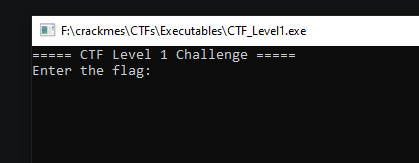
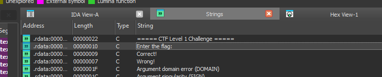
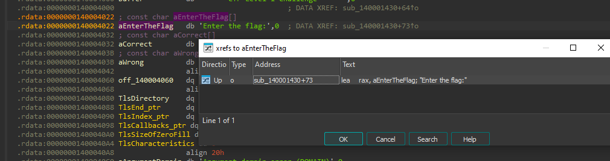
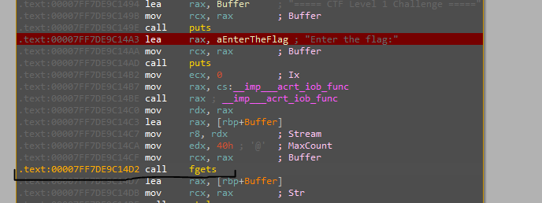
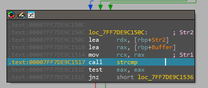
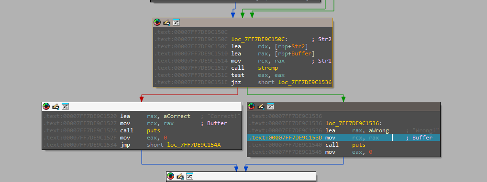
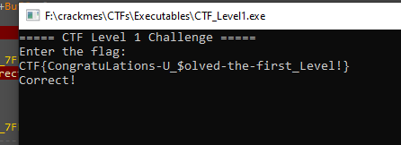

Firt thing i do is open .exe and see what its going to behave. Thats what program is outputing:

After trying to input something program ends immediately, maybe its printing out if i succesfully logged in or no but loop ends because it have no sleep or anything to stop loop from ending.
But now i can see the message its outputing so lets try put it in IDA and check for that strings.

Nice! I can clearly see message i saw earlier. Also i was right about printing statement if flag is correct
Lets take a look at this string and where and when is it used.

After checking xrefs we can see in what function is it used in. Lets check that out thats where password logic is.

There is moment where program outputs question and wait for user input. BONUS: buffer size for our input is 0x40 so 64 decimal it equals to 63 characters + null terminator.
Next step is to try inputing 12345 as password and see what does program do with it and what does it compare it to.

Alright so register rcx is storing a pointer to a memory region with the string we entered. Lets keep a track of it.

Now its the point where program compare two strings:
First one is : CTF{CongratuLations-U_$olved-the-first_Level!}
second one is our password we entered: 12345

Of course its gonna be wrong but now we know password is : CTF{CongratuLations-U_$olved-the-first_Level!}

## flag
CTF{CongratuLations-U_$olved-the-first_Level!}

